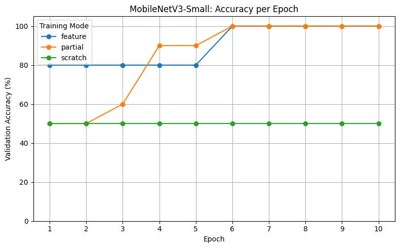
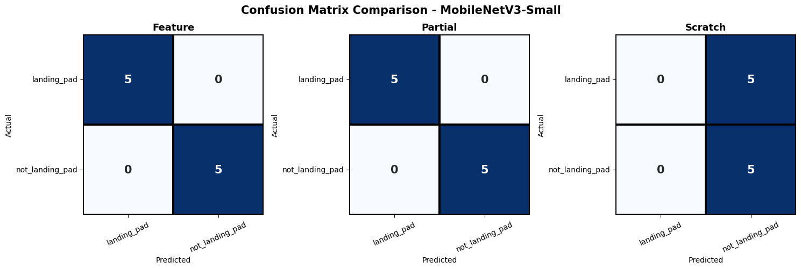

# MobileNetV3-LandingPad-Classification

Klasifikasi citra `landing_pad` dan `not_landing_pad` menggunakan MobileNetV3-Small dengan tiga strategi pelatihan: Feature Extraction, Partial Fine-Tuning, dan Training from Scratch.

## 1. Dataset & Preprocessing

Dataset terdiri dari dua kelas: `landing_pad` dan `not_landing_pad`, yang dibagi menjadi training, validation, dan test set.
Training menggunakan augmentasi random crop, horizontal flip, dan color jitter. Seluruh citra berukuran input 224 × 224 piksel dan dinormalisasi menggunakan statistik ImageNet.

| Parameter | Nilai |
|---|---|
| Model | MobileNetV3-Small |
| Jumlah kelas | 2 |
| Epoch | 10 |
| Batch size | 16 |
| Optimizer | Adam |
| Learning rate | \(10^{-3}\); khusus Partial Fine-Tuning, feature extractor menggunakan \(10^{-4}\) |

## 2. Strategi Pelatihan

- **Feature Extraction:** feature extractor pretrained ImageNet dibekukan; hanya classifier dilatih.
- **Partial Fine-Tuning:** classifier dan dua modul terakhir feature extractor dilatih.
- **Training from Scratch:** tanpa bobot pretrained; seluruh parameter dilatih.

## 3. Hasil dan Analisis

### Akurasi Validasi

| Metode | Akurasi Terbaik | Epoch Terbaik | Epoch ≥90% | Waktu Training |
|---|---:|---:|---:|---:|
| Feature Extraction | 100% | 6 | 6 | 31,29 detik |
| Partial Fine-Tuning | 100% | 6 | 4 | 29,42 detik |
| Training from Scratch | 50% | 1 | Tidak tercapai | 58,28 detik |

Feature Extraction dan Partial Fine-Tuning mencapai akurasi validasi terbaik yang sama. Partial Fine-Tuning mencapai ambang 90% lebih awal. Training from Scratch menghasilkan akurasi lebih rendah dan waktu training lebih lama pada konfigurasi ini.

### Akurasi Test

| Metode | Prediksi Benar | Akurasi |
|---|---:|---:|
| Feature Extraction | 10/10 | 100% |
| Partial Fine-Tuning | 10/10 | 100% |
| Training from Scratch | 5/10 | 50% |

Test set hanya berisi 10 citra, sehingga hasil belum cukup untuk memastikan generalisasi model pada data baru.

## 4. Inference Latency

| Model | Hasil |
|---|---|
| Mode | partial |
| Perangkat | CPU |
| Rata-rata latency | 19.147 ms |
| Estimasi FPS | 61.11 |

| Model | Hasil |
|---|---|
| Mode | partial |
| Perangkat | GPU |
| Rata-rata latency | 5.084 ms |
| Estimasi FPS | 195.16 |

Latency diukur pada inferensi model per citra, tidak termasuk preprocessing dan pengambilan gambar dari kamera.

## 5. Kesimpulan

Feature Extraction dan Partial Fine-Tuning menunjukkan performa klasifikasi yang sama, dengan akurasi validasi dan test sebesar 100%. Namun, Partial Fine-Tuning mencapai akurasi validasi ≥90% lebih awal, yaitu pada epoch ke-4, dan memiliki waktu training sedikit lebih singkat, yaitu 29,42 detik dibandingkan 31,29 detik pada Feature Extraction.

Sebaliknya, Training from Scratch hanya mencapai akurasi test 50% dan membutuhkan waktu training paling lama, yaitu 58,28 detik. Hasil ini menunjukkan bahwa pada konfigurasi eksperimen yang digunakan, kedua metode pretrained memberikan hasil klasifikasi lebih baik dibandingkan Training from Scratch.

Berdasarkan hasil tersebut, Partial Fine-Tuning dapat dipertimbangkan ketika ingin menyesuaikan sebagian fitur model pretrained dengan dataset, sedangkan Feature Extraction memberikan akurasi yang sama tanpa melatih ulang feature extractor. Namun, karena test set hanya terdiri dari 10 citra, diperlukan pengujian dengan dataset yang lebih besar untuk memastikan kemampuan generalisasi model.
